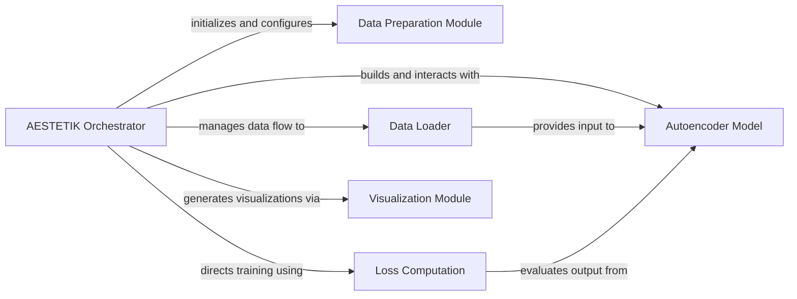

## Component Details

This graph illustrates the core components of the AESTETIK system, focusing on the central Orchestrator and its interactions with modules responsible for data preparation, loading, model training, loss calculation, and result visualization. The main flow involves the Orchestrator initializing and coordinating these components to process data, train the autoencoder model, compute loss, and present the results.

### AESTETIK Orchestrator
The central component responsible for initializing and managing the data loading, model training, optimization, loss calculation, and result visualization processes. It coordinates the flow of data and operations across various sub-components.

**Related Classes/Methods**:

- <a href="https://github.com/ratschlab/aestetik/blob/master/aestetik/AESTETIK.py#L22-L465" target="_blank" rel="noopener noreferrer">`aestetik.aestetik.AESTETIK.AESTETIK` (22:465)</a>
- <a href="https://github.com/ratschlab/aestetik/blob/master/aestetik/AESTETIK.py#L23-L182" target="_blank" rel="noopener noreferrer">`aestetik.aestetik.AESTETIK.AESTETIK:__init__` (23:182)</a>
- <a href="https://github.com/ratschlab/aestetik/blob/master/aestetik/AESTETIK.py#L189-L227" target="_blank" rel="noopener noreferrer">`aestetik.aestetik.AESTETIK.AESTETIK:prepare_input_for_model` (189:227)</a>
- <a href="https://github.com/ratschlab/aestetik/blob/master/aestetik/AESTETIK.py#L247-L259" target="_blank" rel="noopener noreferrer">`aestetik.aestetik.AESTETIK.AESTETIK:_init_data_loader` (247:259)</a>
- <a href="https://github.com/ratschlab/aestetik/blob/master/aestetik/AESTETIK.py#L261-L272" target="_blank" rel="noopener noreferrer">`aestetik.aestetik.AESTETIK.AESTETIK:_init_model` (261:272)</a>
- <a href="https://github.com/ratschlab/aestetik/blob/master/aestetik/AESTETIK.py#L274-L282" target="_blank" rel="noopener noreferrer">`aestetik.aestetik.AESTETIK.AESTETIK:_init_optim_and_loss` (274:282)</a>
- <a href="https://github.com/ratschlab/aestetik/blob/master/aestetik/AESTETIK.py#L284-L342" target="_blank" rel="noopener noreferrer">`aestetik.aestetik.AESTETIK.AESTETIK:train` (284:342)</a>
- <a href="https://github.com/ratschlab/aestetik/blob/master/aestetik/AESTETIK.py#L344-L370" target="_blank" rel="noopener noreferrer">`aestetik.aestetik.AESTETIK.AESTETIK:compute_spot_representations` (344:370)</a>
- <a href="https://github.com/ratschlab/aestetik/blob/master/aestetik/AESTETIK.py#L372-L385" target="_blank" rel="noopener noreferrer">`aestetik.aestetik.AESTETIK.AESTETIK:_compute_latent_space` (372:385)</a>
- <a href="https://github.com/ratschlab/aestetik/blob/master/aestetik/AESTETIK.py#L387-L404" target="_blank" rel="noopener noreferrer">`aestetik.aestetik.AESTETIK.AESTETIK:_compute_centroid` (387:404)</a>
- <a href="https://github.com/ratschlab/aestetik/blob/master/aestetik/AESTETIK.py#L406-L416" target="_blank" rel="noopener noreferrer">`aestetik.aestetik.AESTETIK.AESTETIK:_compute_centroid_morphology` (406:416)</a>
- <a href="https://github.com/ratschlab/aestetik/blob/master/aestetik/AESTETIK.py#L418-L461" target="_blank" rel="noopener noreferrer">`aestetik.aestetik.AESTETIK.AESTETIK:vizualize` (418:461)</a>
- <a href="https://github.com/ratschlab/aestetik/blob/master/aestetik/AESTETIK.py#L229-L245" target="_blank" rel="noopener noreferrer">`aestetik.aestetik.AESTETIK.AESTETIK._calibrate_transcriptomics_morphology_ratio` (229:245)</a>

### Data Preparation Module
This module encompasses functions for initial data processing, including clustering of raw input data, generating spatial grids from anndata objects, and utility functions for batching and seed fixing. It prepares the input data into a suitable format for the AESTETIK model.

**Related Classes/Methods**:

- <a href="https://github.com/ratschlab/aestetik/blob/master/aestetik/utils/utils_clustering.py#L135-L219" target="_blank" rel="noopener noreferrer">`aestetik.aestetik.utils.utils_clustering.clustering` (135:219)</a>
- <a href="https://github.com/ratschlab/aestetik/blob/master/aestetik/utils/utils_grid.py#L27-L38" target="_blank" rel="noopener noreferrer">`aestetik.aestetik.utils.utils_grid.fix_seed` (27:38)</a>
- <a href="https://github.com/ratschlab/aestetik/blob/master/aestetik/utils/utils_grid.py#L71-L106" target="_blank" rel="noopener noreferrer">`aestetik.aestetik.utils.utils_grid.create_st_grid` (71:106)</a>
- <a href="https://github.com/ratschlab/aestetik/blob/master/aestetik/utils/utils_grid.py#L109-L121" target="_blank" rel="noopener noreferrer">`aestetik.aestetik.utils.utils_grid.batch` (109:121)</a>

### Data Loader
Responsible for creating and managing the dataset and data loaders used during the training process. It provides batches of data to the model, potentially handling triplet loss specific data structures.

**Related Classes/Methods**:

- <a href="https://github.com/ratschlab/aestetik/blob/master/aestetik/dataloader.py#L6-L154" target="_blank" rel="noopener noreferrer">`aestetik.aestetik.dataloader.CustomDataset` (6:154)</a>

### Autoencoder Model
Defines the neural network architecture, specifically the Autoencoder (AE) model, including its encoder and decoder components. This component is responsible for learning latent representations of the input data.

**Related Classes/Methods**:

- <a href="https://github.com/ratschlab/aestetik/blob/master/aestetik/model.py#L51-L97" target="_blank" rel="noopener noreferrer">`aestetik.aestetik.model.AE` (51:97)</a>
- <a href="https://github.com/ratschlab/aestetik/blob/master/aestetik/model.py#L82-L86" target="_blank" rel="noopener noreferrer">`aestetik.aestetik.model.AE.encoder` (82:86)</a>

### Loss Computation
This component handles the calculation of the combined loss function during model training, incorporating reconstruction and triplet loss components based on specified weights.

**Related Classes/Methods**:

- <a href="https://github.com/ratschlab/aestetik/blob/master/aestetik/loss_function.py#L39-L89" target="_blank" rel="noopener noreferrer">`aestetik.aestetik.loss_function.compute_loss` (39:89)</a>

### Visualization Module
Provides a suite of functions for generating various plots and visualizations of the model's training progress and results, such as loss curves, spatial cluster distributions, and centroid-related plots.

**Related Classes/Methods**:

- <a href="https://github.com/ratschlab/aestetik/blob/master/aestetik/utils/utils_vizualization.py#L23-L27" target="_blank" rel="noopener noreferrer">`aestetik.aestetik.utils.utils_vizualization.plot_loss_values` (23:27)</a>
- <a href="https://github.com/ratschlab/aestetik/blob/master/aestetik/utils/utils_vizualization.py#L45-L77" target="_blank" rel="noopener noreferrer">`aestetik.aestetik.utils.utils_vizualization.plot_spatial_scatter_ari` (45:77)</a>
- `aestetik.aestetik.utils.utils_vizualation.plot_spots` (full file reference)
- <a href="https://github.com/ratschlab/aestetik/blob/master/aestetik/utils/utils_vizualization.py#L30-L42" target="_blank" rel="noopener noreferrer">`aestetik.aestetik.utils.utils_vizualization.plot_spatial_centroids_and_distance` (30:42)</a>

### [FAQ](https://github.com/CodeBoarding/GeneratedOnBoardings/tree/main?tab=readme-ov-file#faq)