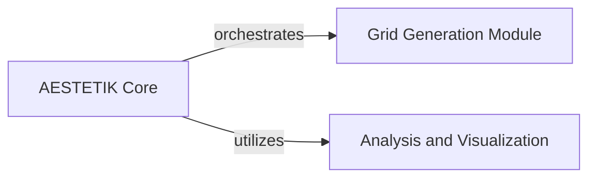

## Component Details

This graph illustrates the core components of the AESTETIK model, focusing on how the central AESTETIK Core orchestrates data preparation and analysis. It shows the interaction with the Grid Generation Module for spatial data processing and the Analysis and Visualization component for clustering and visual representation of results. The main flow involves the AESTETIK Core preparing input, utilizing the grid generation, and then leveraging the analysis and visualization capabilities to present the findings.

### AESTETIK Core
The main class of the AESTETIK model, responsible for initializing the model, preparing input data, training the autoencoder, computing spot representations, and orchestrating the overall analysis and visualization pipeline.

**Related Classes/Methods**:

- <a href="https://github.com/ratschlab/aestetik/blob/master/aestetik/AESTETIK.py#L22-L465" target="_blank" rel="noopener noreferrer">`aestetik.aestetik.AESTETIK.AESTETIK` (22:465)</a>
- <a href="https://github.com/ratschlab/aestetik/blob/master/aestetik/AESTETIK.py#L189-L227" target="_blank" rel="noopener noreferrer">`aestetik.aestetik.AESTETIK.AESTETIK:prepare_input_for_model` (189:227)</a>
- <a href="https://github.com/ratschlab/aestetik/blob/master/aestetik/AESTETIK.py#L229-L245" target="_blank" rel="noopener noreferrer">`aestetik.aestetik.AESTETIK.AESTETIK:_calibrate_transcriptomics_morphology_ratio` (229:245)</a>
- <a href="https://github.com/ratschlab/aestetik/blob/master/aestetik/AESTETIK.py#L344-L370" target="_blank" rel="noopener noreferrer">`aestetik.aestetik.AESTETIK.AESTETIK:compute_spot_representations` (344:370)</a>
- <a href="https://github.com/ratschlab/aestetik/blob/master/aestetik/AESTETIK.py#L372-L385" target="_blank" rel="noopener noreferrer">`aestetik.aestetik.AESTETIK.AESTETIK:_compute_latent_space` (372:385)</a>
- <a href="https://github.com/ratschlab/aestetik/blob/master/aestetik/AESTETIK.py#L387-L404" target="_blank" rel="noopener noreferrer">`aestetik.aestetik.AESTETIK.AESTETIK:_compute_centroid` (387:404)</a>
- <a href="https://github.com/ratschlab/aestetik/blob/master/aestetik/AESTETIK.py#L406-L416" target="_blank" rel="noopener noreferrer">`aestetik.aestetik.AESTETIK.AESTETIK:_compute_centroid_morphology` (406:416)</a>
- <a href="https://github.com/ratschlab/aestetik/blob/master/aestetik/AESTETIK.py#L418-L461" target="_blank" rel="noopener noreferrer">`aestetik.aestetik.AESTETIK.AESTETIK:vizualize` (418:461)</a>

### Grid Generation Module
This component is responsible for creating spatial grids from the input data. It processes the spatial coordinates and feature embeddings to generate a grid representation suitable for the AESTETIK model.

**Related Classes/Methods**:

- <a href="https://github.com/ratschlab/aestetik/blob/master/aestetik/utils/utils_grid.py#L71-L106" target="_blank" rel="noopener noreferrer">`aestetik.aestetik.utils.utils_grid.create_st_grid` (71:106)</a>

### Analysis and Visualization
This component provides comprehensive functionalities for performing clustering operations on latent space representations, computing centroids for cluster analysis, and offering a suite of functions for plotting and visualizing various results derived from the AESTETIK model. It integrates clustering algorithms and visualization utilities.

**Related Classes/Methods**:

- <a href="https://github.com/ratschlab/aestetik/blob/master/aestetik/utils/utils_clustering.py#L135-L219" target="_blank" rel="noopener noreferrer">`aestetik.aestetik.utils.utils_clustering.clustering` (135:219)</a>
- <a href="https://github.com/ratschlab/aestetik/blob/master/aestetik/utils/utils_clustering.py#L78-L132" target="_blank" rel="noopener noreferrer">`aestetik.aestetik.utils.utils_clustering.search_res` (78:132)</a>
- <a href="https://github.com/ratschlab/aestetik/blob/master/aestetik/utils/utils_vizualization.py#L90-L108" target="_blank" rel="noopener noreferrer">`aestetik.aestetik.utils.utils_vizualization.plot_spots` (90:108)</a>
- <a href="https://github.com/ratschlab/aestetik/blob/master/aestetik/utils/utils_vizualization.py#L80-L87" target="_blank" rel="noopener noreferrer">`aestetik.aestetik.utils.utils_vizualization.get_spot` (80:87)</a>
- <a href="https://github.com/ratschlab/aestetik/blob/master/aestetik/utils/utils_vizualization.py#L23-L27" target="_blank" rel="noopener noreferrer">`aestetik.aestetik.utils.utils_vizualization.plot_loss_values` (23:27)</a>
- <a href="https://github.com/ratschlab/aestetik/blob/master/aestetik/utils/utils_vizualization.py#L45-L77" target="_blank" rel="noopener noreferrer">`aestetik.aestetik.utils.utils_vizualization.plot_spatial_scatter_ari` (45:77)</a>
- <a href="https://github.com/ratschlab/aestetik/blob/master/aestetik/utils/utils_vizualization.py#L30-L42" target="_blank" rel="noopener noreferrer">`aestetik.aestetik.utils.utils_vizualization.plot_spatial_centroids_and_distance` (30:42)</a>
- `sklearn.neighbors.NearestCentroid` (full file reference)
- `scipy.spatial.distance.cdist` (full file reference)

### [FAQ](https://github.com/CodeBoarding/GeneratedOnBoardings/tree/main?tab=readme-ov-file#faq)