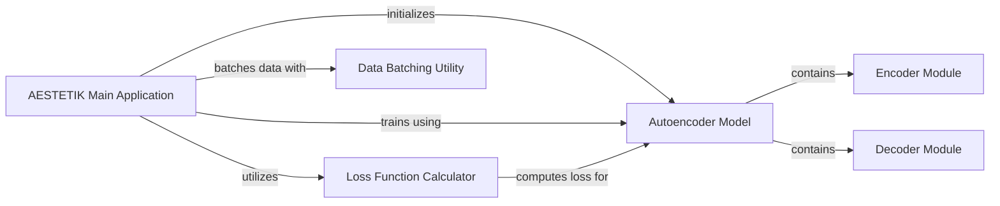

## Component Details

This system provides a comprehensive solution for spatial transcriptomics analysis, centered around an autoencoder model. The AESTETIK Main Application orchestrates the entire pipeline, handling model initialization, data management, training, and the computation of latent space representations. The Autoencoder Model, comprising distinct Encoder and Decoder Modules, is responsible for learning compressed data representations and reconstructing original data. The training process is guided by the Loss Function Calculator, which computes various loss components, while the Data Batching Utility ensures efficient data processing for optimal performance.

### AESTETIK Main Application
This component represents the core application logic, responsible for initializing the model, managing data, training, and computing spot representations. It acts as the orchestrator of the entire AESTETIK pipeline, coordinating various sub-components to achieve the overall goal of spatial transcriptomics analysis.

**Related Classes/Methods**:

- <a href="https://github.com/ratschlab/aestetik/blob/master/aestetik/AESTETIK.py#L22-L465" target="_blank" rel="noopener noreferrer">`aestetik.aestetik.AESTETIK.AESTETIK` (22:465)</a>
- <a href="https://github.com/ratschlab/aestetik/blob/master/aestetik/AESTETIK.py#L261-L272" target="_blank" rel="noopener noreferrer">`aestetik.aestetik.AESTETIK.AESTETIK:_init_model` (261:272)</a>
- <a href="https://github.com/ratschlab/aestetik/blob/master/aestetik/AESTETIK.py#L284-L342" target="_blank" rel="noopener noreferrer">`aestetik.aestetik.AESTETIK.AESTETIK:train` (284:342)</a>
- <a href="https://github.com/ratschlab/aestetik/blob/master/aestetik/AESTETIK.py#L372-L385" target="_blank" rel="noopener noreferrer">`aestetik.aestetik.AESTETIK.AESTETIK:_compute_latent_space` (372:385)</a>

### Autoencoder Model
This component defines the autoencoder neural network architecture, including its encoder and decoder parts. It is responsible for learning compressed latent representations of input data and subsequently reconstructing the original data from these representations, forming the core of the dimensionality reduction and feature extraction.

**Related Classes/Methods**:

- <a href="https://github.com/ratschlab/aestetik/blob/master/aestetik/model.py#L51-L97" target="_blank" rel="noopener noreferrer">`aestetik.aestetik.model.AE` (51:97)</a>
- <a href="https://github.com/ratschlab/aestetik/blob/master/aestetik/model.py#L52-L80" target="_blank" rel="noopener noreferrer">`aestetik.aestetik.model.AE:__init__` (52:80)</a>
- <a href="https://github.com/ratschlab/aestetik/blob/master/aestetik/model.py#L94-L97" target="_blank" rel="noopener noreferrer">`aestetik.aestetik.model.AE:forward` (94:97)</a>
- <a href="https://github.com/ratschlab/aestetik/blob/master/aestetik/model.py#L82-L86" target="_blank" rel="noopener noreferrer">`aestetik.aestetik.model.AE.encoder` (82:86)</a>
- <a href="https://github.com/ratschlab/aestetik/blob/master/aestetik/model.py#L88-L92" target="_blank" rel="noopener noreferrer">`aestetik.aestetik.model.AE.decoder` (88:92)</a>

### Encoder Module
This component specifically handles the encoding process within the autoencoder. It transforms high-dimensional input data into a lower-dimensional, meaningful latent space representation, capturing the essential features of the input.

**Related Classes/Methods**:

- <a href="https://github.com/ratschlab/aestetik/blob/master/aestetik/model.py#L8-L26" target="_blank" rel="noopener noreferrer">`aestetik.aestetik.model.Encode` (8:26)</a>

### Decoder Module
This component specifically handles the decoding process within the autoencoder. It takes the latent space representation generated by the encoder and reconstructs the original input data, aiming to minimize the reconstruction error.

**Related Classes/Methods**:

- <a href="https://github.com/ratschlab/aestetik/blob/master/aestetik/model.py#L29-L48" target="_blank" rel="noopener noreferrer">`aestetik.aestetik.model.Decode` (29:48)</a>

### Loss Function Calculator
This component is responsible for computing the various loss components, including reconstruction loss and triplet loss, that are crucial for guiding the training of the autoencoder model. It quantifies the discrepancy between predicted and actual outputs, enabling the model to learn effectively.

**Related Classes/Methods**:

- <a href="https://github.com/ratschlab/aestetik/blob/master/aestetik/loss_function.py#L39-L89" target="_blank" rel="noopener noreferrer">`aestetik.aestetik.loss_function.compute_loss` (39:89)</a>

### Data Batching Utility
This component provides utility functions for efficiently processing data in manageable batches. It is particularly used for preparing input data for the model's encoder during the computation of latent space representations, optimizing memory usage and computational efficiency.

**Related Classes/Methods**:

- <a href="https://github.com/ratschlab/aestetik/blob/master/aestetik/utils/utils_grid.py#L109-L121" target="_blank" rel="noopener noreferrer">`aestetik.aestetik.utils.utils_grid.batch` (109:121)</a>

### [FAQ](https://github.com/CodeBoarding/GeneratedOnBoardings/tree/main?tab=readme-ov-file#faq)