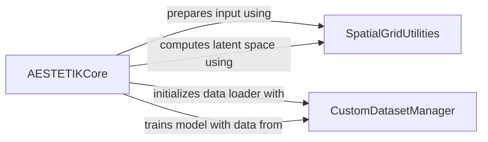

## Component Details

The AESTETIK system is designed to process spatial transcriptomics and morphology data to compute latent space representations and perform clustering. The main flow involves the `AESTETIKCore` component orchestrating the entire process. It first prepares the input data by utilizing `SpatialGridUtilities` to create spatial grids. Subsequently, it initializes the `CustomDatasetManager` to handle data loading, preprocessing, and batching, ensuring the data is correctly formatted for model input, including the generation of positive and negative samples for triplet loss. The `AESTETIKCore` then trains the underlying autoencoder model using the prepared data from the `CustomDatasetManager` and finally computes and clusters the latent space representations, again leveraging `SpatialGridUtilities` for batching during inference.

### AESTETIKCore
The central orchestrator of the AESTETIK model, managing the entire workflow from input preparation and data loading to model training, latent space computation, and result visualization.

**Related Classes/Methods**:

- <a href="https://github.com/ratschlab/aestetik/blob/master/aestetik/AESTETIK.py#L22-L465" target="_blank" rel="noopener noreferrer">`aestetik.aestetik.AESTETIK.AESTETIK` (22:465)</a>
- <a href="https://github.com/ratschlab/aestetik/blob/master/aestetik/AESTETIK.py#L189-L227" target="_blank" rel="noopener noreferrer">`aestetik.aestetik.AESTETIK.AESTETIK:prepare_input_for_model` (189:227)</a>
- <a href="https://github.com/ratschlab/aestetik/blob/master/aestetik/AESTETIK.py#L247-L259" target="_blank" rel="noopener noreferrer">`aestetik.aestetik.AESTETIK.AESTETIK:_init_data_loader` (247:259)</a>
- <a href="https://github.com/ratschlab/aestetik/blob/master/aestetik/AESTETIK.py#L372-L385" target="_blank" rel="noopener noreferrer">`aestetik.aestetik.AESTETIK.AESTETIK:_compute_latent_space` (372:385)</a>
- <a href="https://github.com/ratschlab/aestetik/blob/master/aestetik/AESTETIK.py#L284-L342" target="_blank" rel="noopener noreferrer">`aestetik.aestetik.AESTETIK.AESTETIK:train` (284:342)</a>
- <a href="https://github.com/ratschlab/aestetik/blob/master/aestetik/AESTETIK.py#L344-L370" target="_blank" rel="noopener noreferrer">`aestetik.aestetik.AESTETIK.AESTETIK:compute_spot_representations` (344:370)</a>

### CustomDatasetManager
Handles the loading, preprocessing, and batching of custom datasets, including the computation of training indices and the generation of positive and negative samples for different data modalities (transcriptomics and morphology) to prepare data for model input.

**Related Classes/Methods**:

- <a href="https://github.com/ratschlab/aestetik/blob/master/aestetik/dataloader.py#L6-L154" target="_blank" rel="noopener noreferrer">`aestetik.aestetik.dataloader.CustomDataset` (6:154)</a>
- <a href="https://github.com/ratschlab/aestetik/blob/master/aestetik/dataloader.py#L7-L55" target="_blank" rel="noopener noreferrer">`aestetik.aestetik.dataloader.CustomDataset:__init__` (7:55)</a>
- <a href="https://github.com/ratschlab/aestetik/blob/master/aestetik/dataloader.py#L60-L62" target="_blank" rel="noopener noreferrer">`aestetik.aestetik.dataloader.CustomDataset:_compute_train_idx` (60:62)</a>
- <a href="https://github.com/ratschlab/aestetik/blob/master/aestetik/dataloader.py#L89-L95" target="_blank" rel="noopener noreferrer">`aestetik.aestetik.dataloader.CustomDataset:_compute_transcriptomics_list` (89:95)</a>
- <a href="https://github.com/ratschlab/aestetik/blob/master/aestetik/dataloader.py#L97-L103" target="_blank" rel="noopener noreferrer">`aestetik.aestetik.dataloader.CustomDataset:_compute_morphology_list` (97:103)</a>
- <a href="https://github.com/ratschlab/aestetik/blob/master/aestetik/dataloader.py#L105-L111" target="_blank" rel="noopener noreferrer">`aestetik.aestetik.dataloader.CustomDataset:_compute_transcriptomics_only` (105:111)</a>
- <a href="https://github.com/ratschlab/aestetik/blob/master/aestetik/dataloader.py#L113-L119" target="_blank" rel="noopener noreferrer">`aestetik.aestetik.dataloader.CustomDataset:_compute_morphology_only` (113:119)</a>
- <a href="https://github.com/ratschlab/aestetik/blob/master/aestetik/dataloader.py#L129-L137" target="_blank" rel="noopener noreferrer">`aestetik.aestetik.dataloader.CustomDataset:_compute_transcriptomics_and_morphology` (129:137)</a>
- <a href="https://github.com/ratschlab/aestetik/blob/master/aestetik/dataloader.py#L139-L154" target="_blank" rel="noopener noreferrer">`aestetik.aestetik.dataloader.CustomDataset:__getitem__` (139:154)</a>
- <a href="https://github.com/ratschlab/aestetik/blob/master/aestetik/dataloader.py#L64-L87" target="_blank" rel="noopener noreferrer">`aestetik.aestetik.dataloader.CustomDataset._compute_list` (64:87)</a>

### SpatialGridUtilities
Provides essential utility functions for creating spatial grids from input data, managing data batching, and generating individual spots, which are crucial for preparing the spatial transcriptomics and morphology data for the AESTETIK model.

**Related Classes/Methods**:

- <a href="https://github.com/ratschlab/aestetik/blob/master/aestetik/utils/utils_grid.py#L71-L106" target="_blank" rel="noopener noreferrer">`aestetik.aestetik.utils.utils_grid.create_st_grid` (71:106)</a>
- <a href="https://github.com/ratschlab/aestetik/blob/master/aestetik/utils/utils_grid.py#L109-L121" target="_blank" rel="noopener noreferrer">`aestetik.aestetik.utils.utils_grid.batch` (109:121)</a>
- <a href="https://github.com/ratschlab/aestetik/blob/master/aestetik/utils/utils_grid.py#L59-L68" target="_blank" rel="noopener noreferrer">`aestetik.aestetik.utils.utils_grid._create_batch_grid` (59:68)</a>
- <a href="https://github.com/ratschlab/aestetik/blob/master/aestetik/utils/utils_grid.py#L41-L56" target="_blank" rel="noopener noreferrer">`aestetik.aestetik.utils.utils_grid._create_spot` (41:56)</a>

### [FAQ](https://github.com/CodeBoarding/GeneratedOnBoardings/tree/main?tab=readme-ov-file#faq)