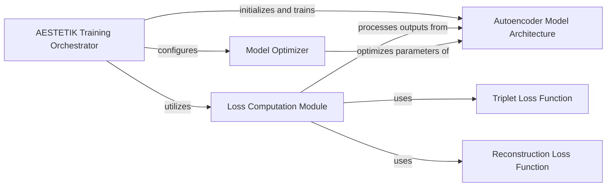

## Component Details

This graph illustrates the key components involved in the training and optimization of the AESTETIK autoencoder model. It highlights the orchestration of the training process, the computation of various loss components, the model architecture itself, and the optimization algorithm used to update the model's parameters.

### AESTETIK Training Orchestrator
Orchestrates the entire training process of the AESTETIK model, including data loading, model initialization, and the iterative training loop.

**Related Classes/Methods**:

- <a href="https://github.com/ratschlab/aestetik/blob/master/aestetik/AESTETIK.py#L284-L342" target="_blank" rel="noopener noreferrer">`aestetik.aestetik.AESTETIK.AESTETIK:train` (284:342)</a>
- <a href="https://github.com/ratschlab/aestetik/blob/master/aestetik/AESTETIK.py#L247-L259" target="_blank" rel="noopener noreferrer">`aestetik.aestetik.AESTETIK.AESTETIK._init_data_loader` (247:259)</a>
- <a href="https://github.com/ratschlab/aestetik/blob/master/aestetik/AESTETIK.py#L261-L272" target="_blank" rel="noopener noreferrer">`aestetik.aestetik.AESTETIK.AESTETIK._init_model` (261:272)</a>
- <a href="https://github.com/ratschlab/aestetik/blob/master/aestetik/AESTETIK.py#L274-L282" target="_blank" rel="noopener noreferrer">`aestetik.aestetik.AESTETIK.AESTETIK._init_optim_and_loss` (274:282)</a>

### Loss Computation Module
Responsible for calculating the composite loss used in training, combining triplet loss and reconstruction loss.

**Related Classes/Methods**:

- <a href="https://github.com/ratschlab/aestetik/blob/master/aestetik/loss_function.py#L39-L89" target="_blank" rel="noopener noreferrer">`aestetik.aestetik.loss_function.compute_loss` (39:89)</a>
- <a href="https://github.com/ratschlab/aestetik/blob/master/aestetik/loss_function.py#L4-L29" target="_blank" rel="noopener noreferrer">`aestetik.aestetik.loss_function.compute_average_triplet_loss` (4:29)</a>
- <a href="https://github.com/ratschlab/aestetik/blob/master/aestetik/loss_function.py#L32-L36" target="_blank" rel="noopener noreferrer">`aestetik.aestetik.loss_function.compute_reconstruction_loss` (32:36)</a>

### Autoencoder Model Architecture
Defines the neural network structure of the autoencoder, including its encoder and decoder parts.

**Related Classes/Methods**:

- <a href="https://github.com/ratschlab/aestetik/blob/master/aestetik/model.py#L51-L97" target="_blank" rel="noopener noreferrer">`aestetik.aestetik.model.AE` (51:97)</a>
- <a href="https://github.com/ratschlab/aestetik/blob/master/aestetik/model.py#L8-L26" target="_blank" rel="noopener noreferrer">`aestetik.aestetik.model.Encode` (8:26)</a>
- <a href="https://github.com/ratschlab/aestetik/blob/master/aestetik/model.py#L29-L48" target="_blank" rel="noopener noreferrer">`aestetik.aestetik.model.Decode` (29:48)</a>

### Triplet Loss Function
Implements the triplet margin loss, used to ensure that embeddings of similar items are closer than dissimilar items.

**Related Classes/Methods**:

- `torch.nn.TripletMarginLoss` (full file reference)

### Reconstruction Loss Function
Implements the L1 loss, used to measure the difference between the input and reconstructed output of the autoencoder.

**Related Classes/Methods**:

- `torch.nn.L1Loss` (full file reference)

### Model Optimizer
Manages the optimization algorithm (Adam) used to update the model's parameters based on the computed gradients.

**Related Classes/Methods**:

- `torch.optim.Adam` (full file reference)

### [FAQ](https://github.com/CodeBoarding/GeneratedOnBoardings/tree/main?tab=readme-ov-file#faq)