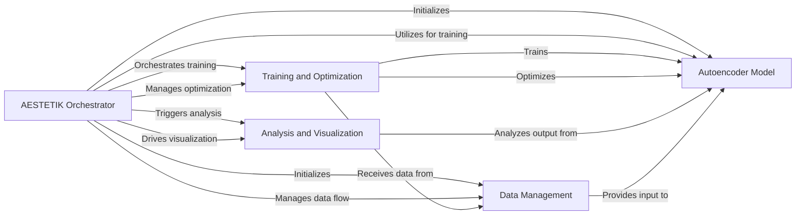

## Component Details

The `aestetik` project implements a deep learning framework for analyzing spatial transcriptomics and morphology data. The main flow involves an `AESTETIK Orchestrator` that initializes and coordinates data loading, model training, optimization, and subsequent analysis and visualization. Data is prepared by the `Data Management` component and fed into the `Autoencoder Model`. The `Training and Optimization` component handles the learning process, while `Analysis and Visualization` provides insights into the model's output.

### AESTETIK Orchestrator
The central component responsible for initializing and managing the data loading, model training, optimization, loss calculation, and result visualization processes. It coordinates the flow of data and operations across various sub-components.

**Related Classes/Methods**:

- <a href="https://github.com/ratschlab/aestetik/blob/master/aestetik/AESTETIK.py#L22-L465" target="_blank" rel="noopener noreferrer">`aestetik.aestetik.AESTETIK.AESTETIK` (22:465)</a>
- <a href="https://github.com/ratschlab/aestetik/blob/master/aestetik/AESTETIK.py#L23-L182" target="_blank" rel="noopener noreferrer">`aestetik.aestetik.AESTETIK.AESTETIK:__init__` (23:182)</a>
- <a href="https://github.com/ratschlab/aestetik/blob/master/aestetik/AESTETIK.py#L189-L227" target="_blank" rel="noopener noreferrer">`aestetik.aestetik.AESTETIK.AESTETIK:prepare_input_for_model` (189:227)</a>
- <a href="https://github.com/ratschlab/aestetik/blob/master/aestetik/AESTETIK.py#L247-L259" target="_blank" rel="noopener noreferrer">`aestetik.aestetik.AESTETIK.AESTETIK:_init_data_loader` (247:259)</a>
- <a href="https://github.com/ratschlab/aestetik/blob/master/aestetik/AESTETIK.py#L261-L272" target="_blank" rel="noopener noreferrer">`aestetik.aestetik.AESTETIK.AESTETIK:_init_model` (261:272)</a>
- <a href="https://github.com/ratschlab/aestetik/blob/master/aestetik/AESTETIK.py#L274-L282" target="_blank" rel="noopener noreferrer">`aestetik.aestetik.AESTETIK.AESTETIK:_init_optim_and_loss` (274:282)</a>
- <a href="https://github.com/ratschlab/aestetik/blob/master/aestetik/AESTETIK.py#L284-L342" target="_blank" rel="noopener noreferrer">`aestetik.aestetik.AESTETIK.AESTETIK:train` (284:342)</a>
- <a href="https://github.com/ratschlab/aestetik/blob/master/aestetik/AESTETIK.py#L344-L370" target="_blank" rel="noopener noreferrer">`aestetik.aestetik.AESTETIK.AESTETIK:compute_spot_representations` (344:370)</a>
- <a href="https://github.com/ratschlab/aestetik/blob/master/aestetik/AESTETIK.py#L372-L385" target="_blank" rel="noopener noreferrer">`aestetik.aestetik.AESTETIK.AESTETIK:_compute_latent_space` (372:385)</a>
- <a href="https://github.com/ratschlab/aestetik/blob/master/aestetik/AESTETIK.py#L387-L404" target="_blank" rel="noopener noreferrer">`aestetik.aestetik.AESTETIK.AESTETIK:_compute_centroid` (387:404)</a>
- <a href="https://github.com/ratschlab/aestetik/blob/master/aestetik/AESTETIK.py#L406-L416" target="_blank" rel="noopener noreferrer">`aestetik.aestetik.AESTETIK.AESTETIK:_compute_centroid_morphology` (406:416)</a>
- <a href="https://github.com/ratschlab/aestetik/blob/master/aestetik/AESTETIK.py#L418-L461" target="_blank" rel="noopener noreferrer">`aestetik.aestetik.AESTETIK.AESTETIK:vizualize` (418:461)</a>
- <a href="https://github.com/ratschlab/aestetik/blob/master/aestetik/AESTETIK.py#L229-L245" target="_blank" rel="noopener noreferrer">`aestetik.aestetik.AESTETIK.AESTETIK._calibrate_transcriptomics_morphology_ratio` (229:245)</a>

### Data Management
Manages the loading, preprocessing, and batching of custom datasets, including spatial transcriptomics and morphology data. It computes training indices, creates spatial grids, and prepares data for model input.

**Related Classes/Methods**:

- <a href="https://github.com/ratschlab/aestetik/blob/master/aestetik/dataloader.py#L6-L154" target="_blank" rel="noopener noreferrer">`aestetik.aestetik.dataloader.CustomDataset` (6:154)</a>
- <a href="https://github.com/ratschlab/aestetik/blob/master/aestetik/dataloader.py#L7-L55" target="_blank" rel="noopener noreferrer">`aestetik.aestetik.dataloader.CustomDataset:__init__` (7:55)</a>
- <a href="https://github.com/ratschlab/aestetik/blob/master/aestetik/dataloader.py#L60-L62" target="_blank" rel="noopener noreferrer">`aestetik.aestetik.dataloader.CustomDataset:_compute_train_idx` (60:62)</a>
- <a href="https://github.com/ratschlab/aestetik/blob/master/aestetik/dataloader.py#L89-L95" target="_blank" rel="noopener noreferrer">`aestetik.aestetik.dataloader.CustomDataset:_compute_transcriptomics_list` (89:95)</a>
- <a href="https://github.com/ratschlab/aestetik/blob/master/aestetik/dataloader.py#L97-L103" target="_blank" rel="noopener noreferrer">`aestetik.aestetik.dataloader.CustomDataset:_compute_morphology_list` (97:103)</a>
- <a href="https://github.com/ratschlab/aestetik/blob/master/aestetik/dataloader.py#L105-L111" target="_blank" rel="noopener noreferrer">`aestetik.aestetik.dataloader.CustomDataset:_compute_transcriptomics_only` (105:111)</a>
- <a href="https://github.com/ratschlab/aestetik/blob/master/aestetik/dataloader.py#L113-L119" target="_blank" rel="noopener noreferrer">`aestetik.aestetik.dataloader.CustomDataset:_compute_morphology_only` (113:119)</a>
- <a href="https://github.com/ratschlab/aestetik/blob/master/aestetik/dataloader.py#L129-L137" target="_blank" rel="noopener noreferrer">`aestetik.aestetik.dataloader.CustomDataset:_compute_transcriptomics_and_morphology` (129:137)</a>
- <a href="https://github.com/ratschlab/aestetik/blob/master/aestetik/dataloader.py#L139-L154" target="_blank" rel="noopener noreferrer">`aestetik.aestetik.dataloader.CustomDataset:__getitem__` (139:154)</a>
- <a href="https://github.com/ratschlab/aestetik/blob/master/aestetik/dataloader.py#L64-L87" target="_blank" rel="noopener noreferrer">`aestetik.aestetik.dataloader.CustomDataset._compute_list` (64:87)</a>
- <a href="https://github.com/ratschlab/aestetik/blob/master/aestetik/utils/utils_grid.py#L71-L106" target="_blank" rel="noopener noreferrer">`aestetik.aestetik.utils.utils_grid.create_st_grid` (71:106)</a>
- <a href="https://github.com/ratschlab/aestetik/blob/master/aestetik/utils/utils_grid.py#L109-L121" target="_blank" rel="noopener noreferrer">`aestetik.aestetik.utils.utils_grid.batch` (109:121)</a>
- <a href="https://github.com/ratschlab/aestetik/blob/master/aestetik/utils/utils_grid.py#L59-L68" target="_blank" rel="noopener noreferrer">`aestetik.aestetik.utils.utils_grid._create_batch_grid` (59:68)</a>
- <a href="https://github.com/ratschlab/aestetik/blob/master/aestetik/utils/utils_grid.py#L41-L56" target="_blank" rel="noopener noreferrer">`aestetik.aestetik.utils.utils_grid._create_spot` (41:56)</a>

### Autoencoder Model
Implements the autoencoder architecture, consisting of an encoder and a decoder, to learn latent space representations from input data.

**Related Classes/Methods**:

- <a href="https://github.com/ratschlab/aestetik/blob/master/aestetik/model.py#L51-L97" target="_blank" rel="noopener noreferrer">`aestetik.aestetik.model.AE` (51:97)</a>
- <a href="https://github.com/ratschlab/aestetik/blob/master/aestetik/model.py#L52-L80" target="_blank" rel="noopener noreferrer">`aestetik.aestetik.model.AE:__init__` (52:80)</a>
- <a href="https://github.com/ratschlab/aestetik/blob/master/aestetik/model.py#L94-L97" target="_blank" rel="noopener noreferrer">`aestetik.aestetik.model.AE:forward` (94:97)</a>
- <a href="https://github.com/ratschlab/aestetik/blob/master/aestetik/model.py#L82-L86" target="_blank" rel="noopener noreferrer">`aestetik.aestetik.model.AE.encoder` (82:86)</a>
- <a href="https://github.com/ratschlab/aestetik/blob/master/aestetik/model.py#L88-L92" target="_blank" rel="noopener noreferrer">`aestetik.aestetik.model.AE.decoder` (88:92)</a>
- <a href="https://github.com/ratschlab/aestetik/blob/master/aestetik/model.py#L8-L26" target="_blank" rel="noopener noreferrer">`aestetik.aestetik.model.Encode` (8:26)</a>
- <a href="https://github.com/ratschlab/aestetik/blob/master/aestetik/model.py#L29-L48" target="_blank" rel="noopener noreferrer">`aestetik.aestetik.model.Decode` (29:48)</a>

### Training and Optimization
Manages the computation of various loss components (e.g., triplet loss, reconstruction loss) and the optimization of the autoencoder model's parameters during training.

**Related Classes/Methods**:

- <a href="https://github.com/ratschlab/aestetik/blob/master/aestetik/loss_function.py#L39-L89" target="_blank" rel="noopener noreferrer">`aestetik.aestetik.loss_function.compute_loss` (39:89)</a>
- <a href="https://github.com/ratschlab/aestetik/blob/master/aestetik/loss_function.py#L4-L29" target="_blank" rel="noopener noreferrer">`aestetik.aestetik.loss_function.compute_average_triplet_loss` (4:29)</a>
- <a href="https://github.com/ratschlab/aestetik/blob/master/aestetik/loss_function.py#L32-L36" target="_blank" rel="noopener noreferrer">`aestetik.aestetik.loss_function.compute_reconstruction_loss` (32:36)</a>
- `torch.nn.TripletMarginLoss` (full file reference)
- `torch.nn.L1Loss` (full file reference)
- `torch.optim.Adam` (full file reference)

### Analysis and Visualization
Provides functionalities for performing clustering operations on latent space representations, computing centroids for cluster analysis, and offering a suite of functions for plotting and visualizing various results.

**Related Classes/Methods**:

- <a href="https://github.com/ratschlab/aestetik/blob/master/aestetik/utils/utils_clustering.py#L135-L219" target="_blank" rel="noopener noreferrer">`aestetik.aestetik.utils.utils_clustering.clustering` (135:219)</a>
- <a href="https://github.com/ratschlab/aestetik/blob/master/aestetik/utils/utils_clustering.py#L78-L132" target="_blank" rel="noopener noreferrer">`aestetik.aestetik.utils.utils_clustering.search_res` (78:132)</a>
- <a href="https://github.com/ratschlab/aestetik/blob/master/aestetik/utils/utils_vizualization.py#L90-L108" target="_blank" rel="noopener noreferrer">`aestetik.aestetik.utils.utils_vizualization.plot_spots` (90:108)</a>
- <a href="https://github.com/ratschlab/aestetik/blob/master/aestetik/utils/utils_vizualization.py#L80-L87" target="_blank" rel="noopener noreferrer">`aestetik.aestetik.utils.utils_vizualization.get_spot` (80:87)</a>
- <a href="https://github.com/ratschlab/aestetik/blob/master/aestetik/utils/utils_vizualization.py#L23-L27" target="_blank" rel="noopener noreferrer">`aestetik.aestetik.utils.utils_vizualization.plot_loss_values` (23:27)</a>
- <a href="https://github.com/ratschlab/aestetik/blob/master/aestetik/utils/utils_vizualization.py#L45-L77" target="_blank" rel="noopener noreferrer">`aestetik.aestetik.utils.utils_vizualization.plot_spatial_scatter_ari` (45:77)</a>
- <a href="https://github.com/ratschlab/aestetik/blob/master/aestetik/utils/utils_vizualization.py#L30-L42" target="_blank" rel="noopener noreferrer">`aestetik.aestetik.utils.utils_vizualization.plot_spatial_centroids_and_distance` (30:42)</a>
- `sklearn.neighbors.NearestCentroid` (full file reference)
- `scipy.spatial.distance.cdist` (full file reference)

### [FAQ](https://github.com/CodeBoarding/GeneratedOnBoardings/tree/main?tab=readme-ov-file#faq)